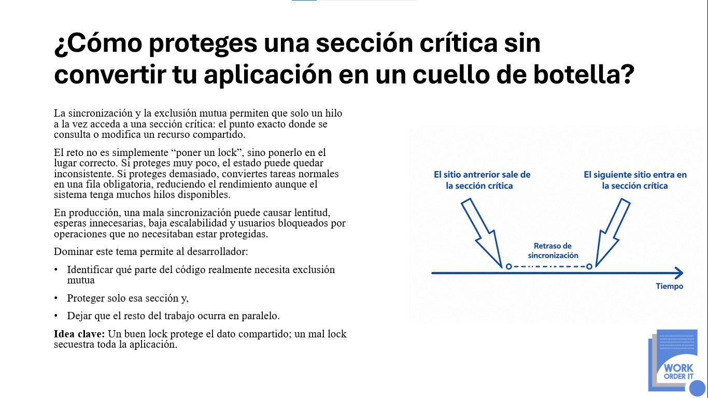

<p align="center">
  
</p>

# Python Critical Sections Without Bottlenecks

Laboratorio práctico para aprender a proteger recursos compartidos sin convertir toda la aplicación en una fila de espera.

El proyecto compara diferentes estrategias de sincronización en **Python 3.13**, mostrando cómo el tamaño y la ubicación de una sección crítica afectan la consistencia, la latencia, el rendimiento y la escalabilidad.

> **Idea clave:** un buen lock protege únicamente el estado compartido; un mal lock bloquea trabajo que podría ejecutarse de manera concurrente.

---

## El problema

Cuando varios hilos consultan o modifican simultáneamente un recurso compartido, pueden producirse:

- Condiciones de carrera.
- Actualizaciones perdidas.
- Datos inconsistentes.
- Inventarios negativos.
- Resultados impredecibles.
- Errores difíciles de reproducir.

La solución habitual consiste en utilizar sincronización o exclusión mutua. Sin embargo, proteger demasiado código también puede provocar:

- Esperas innecesarias.
- Alta contención.
- Mayor latencia.
- Menor throughput.
- Baja escalabilidad.
- Hilos bloqueados por operaciones que no necesitan protección.

El verdadero reto no es simplemente agregar un `Lock`, sino colocarlo alrededor de las instrucciones exactas que deben ejecutarse de forma indivisible.

---

## Objetivo

Demostrar mediante código, pruebas y mediciones cómo:

1. Identificar el estado realmente compartido.
2. Delimitar correctamente una sección crítica.
3. Reducir el tiempo durante el cual se mantiene un lock.
4. Ejecutar operaciones independientes fuera del bloqueo.
5. Comparar diferentes mecanismos de sincronización.
6. Detectar condiciones de carrera.
7. Medir latencia, throughput y contención.

---

## Caso de estudio

El proyecto simula un sistema concurrente de reservas de inventario.

Varios hilos intentan reservar unidades de un producto al mismo tiempo. El sistema debe garantizar que:

- El inventario nunca sea negativo.
- No se vendan más unidades de las disponibles.
- Cada actualización sea consistente.
- Las operaciones independientes no sean bloqueadas.
- El sistema mantenga un buen nivel de concurrencia.

---

## Estrategias implementadas

| Estrategia | Descripción | Propósito |
|---|---|---|
| Sin sincronización | Modifica el inventario sin protección | Evidenciar condiciones de carrera |
| Bloqueo amplio | Protege el método completo | Mostrar el impacto de bloquear demasiado |
| Bloqueo reducido | Protege solo la actualización compartida | Reducir contención |
| `threading.Lock` | Exclusión mutua básica | Proteger una sección crítica |
| `threading.RLock` | Lock reentrante | Permitir adquisiciones anidadas |
| Lock con timeout | Evita esperas indefinidas | Controlar fallos por contención |
| Lock por producto | Cada recurso tiene su propio lock | Evitar un bloqueo global |
| `queue.Queue` | Comunicación segura entre hilos | Evitar manipulación manual compartida |
| `asyncio.Lock` | Exclusión mutua entre coroutines | Proteger estado en código asíncrono |

---

## Ejemplo de mala implementación

En este ejemplo, todo el método se ejecuta dentro del lock:

```python
from __future__ import annotations

import threading
import time


class CoarseGrainedInventoryService:
    def __init__(self, initial_stock: int) -> None:
        self._stock = initial_stock
        self._lock = threading.Lock()

    def reserve(self, product_id: str, quantity: int) -> bool:
        with self._lock:
            self._validate_request(product_id, quantity)

            # Estas operaciones no deberían bloquear a otros hilos.
            self._simulate_external_validation()
            self._simulate_database_query()

            if self._stock < quantity:
                return False

            self._stock -= quantity

            # Tampoco deberían ejecutarse dentro del lock.
            self._simulate_audit()
            self._simulate_notification()

            return True

    @staticmethod
    def _validate_request(product_id: str, quantity: int) -> None:
        if not product_id.strip():
            raise ValueError("product_id is required")

        if quantity <= 0:
            raise ValueError("quantity must be greater than zero")

    @staticmethod
    def _simulate_external_validation() -> None:
        time.sleep(0.01)

    @staticmethod
    def _simulate_database_query() -> None:
        time.sleep(0.01)

    @staticmethod
    def _simulate_audit() -> None:
        time.sleep(0.005)

    @staticmethod
    def _simulate_notification() -> None:
        time.sleep(0.005)
```

Aunque solamente la consulta y modificación de `_stock` necesitan exclusión mutua, también quedan bloqueadas:

- Las validaciones.
- Las consultas externas.
- El registro de auditoría.
- Las notificaciones.
- La preparación de datos.
- La construcción de respuestas.

Esto hace que los hilos ejecuten en serie operaciones que podrían realizarse concurrentemente.

---

## Implementación optimizada

```python
from __future__ import annotations

import threading
import time
from dataclasses import dataclass
from enum import StrEnum


class ReservationStatus(StrEnum):
    APPROVED = "approved"
    REJECTED = "rejected"


@dataclass(frozen=True, slots=True)
class ReservationResult:
    product_id: str
    requested_quantity: int
    remaining_stock: int
    status: ReservationStatus


@dataclass(frozen=True, slots=True)
class ReservationContext:
    product_id: str
    quantity: int


class OptimizedInventoryService:
    def __init__(self, initial_stock: int) -> None:
        if initial_stock < 0:
            raise ValueError("initial_stock cannot be negative")

        self._available_stock = initial_stock
        self._inventory_lock = threading.Lock()

    def reserve(
        self,
        product_id: str,
        quantity: int,
    ) -> ReservationResult:
        self._validate_request(product_id, quantity)

        # Trabajo independiente realizado fuera del lock.
        context = self._prepare_reservation(product_id, quantity)

        with self._inventory_lock:
            # Solo el acceso al estado compartido forma parte
            # de la sección crítica.
            if self._available_stock < quantity:
                result = ReservationResult(
                    product_id=product_id,
                    requested_quantity=quantity,
                    remaining_stock=self._available_stock,
                    status=ReservationStatus.REJECTED,
                )
            else:
                self._available_stock -= quantity

                result = ReservationResult(
                    product_id=product_id,
                    requested_quantity=quantity,
                    remaining_stock=self._available_stock,
                    status=ReservationStatus.APPROVED,
                )

        # Auditoría, métricas y notificaciones fuera del lock.
        self._complete_reservation(context, result)

        return result

    def get_available_stock(self) -> int:
        with self._inventory_lock:
            return self._available_stock

    @staticmethod
    def _validate_request(product_id: str, quantity: int) -> None:
        if not product_id or not product_id.strip():
            raise ValueError("product_id is required")

        if quantity <= 0:
            raise ValueError("quantity must be greater than zero")

    @staticmethod
    def _prepare_reservation(
        product_id: str,
        quantity: int,
    ) -> ReservationContext:
        return ReservationContext(
            product_id=product_id,
            quantity=quantity,
        )

    @staticmethod
    def _complete_reservation(
        context: ReservationContext,
        result: ReservationResult,
    ) -> None:
        del context, result

        # Simulación de auditoría, métricas o notificaciones.
        time.sleep(0.001)
```

La sección crítica queda reducida a:

```python
with self._inventory_lock:
    if self._available_stock >= quantity:
        self._available_stock -= quantity
```

---

## Flujo de ejecución

```text
Validar solicitud
       │
       ▼
Preparar operación
       │
       ▼
Solicitar el lock
       │
       ▼
┌─────────────────────────────┐
│      SECCIÓN CRÍTICA        │
│                             │
│  Consultar inventario       │
│  Actualizar inventario      │
│  Construir resultado        │
└─────────────────────────────┘
       │
       ▼
Liberar el lock
       │
       ▼
Auditoría, métricas y eventos
```

El lock se mantiene durante el menor tiempo posible.

---

## Uso de timeout

Un hilo no siempre debería esperar indefinidamente por un recurso.

```python
from __future__ import annotations

import threading


class InventoryBusyError(RuntimeError):
    pass


class TimeoutInventoryService:
    def __init__(self, initial_stock: int) -> None:
        self._stock = initial_stock
        self._lock = threading.Lock()

    def reserve(
        self,
        quantity: int,
        timeout_seconds: float = 0.5,
    ) -> bool:
        acquired = self._lock.acquire(timeout=timeout_seconds)

        if not acquired:
            raise InventoryBusyError(
                "The inventory resource is temporarily busy"
            )

        try:
            if self._stock < quantity:
                return False

            self._stock -= quantity
            return True
        finally:
            self._lock.release()
```

El bloque `finally` garantiza que el lock se libere aunque ocurra una excepción.

Cuando sea posible, se recomienda utilizar el administrador de contexto:

```python
with lock:
    update_shared_state()
```

---

## Lock por producto

Un lock global puede bloquear operaciones relacionadas con productos diferentes.

La solución consiste en utilizar un lock independiente por recurso:

```python
from __future__ import annotations

import threading
from collections import defaultdict


class ProductInventoryService:
    def __init__(self, initial_inventory: dict[str, int]) -> None:
        self._inventory = initial_inventory.copy()
        self._locks: defaultdict[str, threading.Lock] = defaultdict(
            threading.Lock
        )

    def reserve(self, product_id: str, quantity: int) -> bool:
        if quantity <= 0:
            raise ValueError("quantity must be greater than zero")

        product_lock = self._locks[product_id]

        with product_lock:
            available = self._inventory.get(product_id, 0)

            if available < quantity:
                return False

            self._inventory[product_id] = available - quantity
            return True
```

El comportamiento esperado es:

```text
Producto A ── Lock A
Producto B ── Lock B
Producto C ── Lock C
```

Una reserva del producto A no debería bloquear las reservas de los productos B y C.

> En una aplicación real, la creación y eliminación dinámica de locks debe administrarse cuidadosamente para evitar crecimiento ilimitado de memoria.

---

## Simulación concurrente

```python
from __future__ import annotations

from concurrent.futures import ThreadPoolExecutor
from time import perf_counter

from critical_section.service.optimized_inventory_service import (
    OptimizedInventoryService,
)
from critical_section.model.reservation_result import ReservationStatus


def run_simulation() -> None:
    initial_stock = 10_000
    total_requests = 100_000
    workers = 100

    service = OptimizedInventoryService(initial_stock)

    started_at = perf_counter()

    with ThreadPoolExecutor(
        max_workers=workers,
        thread_name_prefix="reservation-worker",
    ) as executor:
        futures = [
            executor.submit(
                service.reserve,
                "PRODUCT-001",
                1,
            )
            for _ in range(total_requests)
        ]

        results = [future.result() for future in futures]

    elapsed_seconds = perf_counter() - started_at

    approved = sum(
        result.status is ReservationStatus.APPROVED
        for result in results
    )

    rejected = total_requests - approved
    final_stock = service.get_available_stock()
    throughput = total_requests / elapsed_seconds

    print(f"Requests: {total_requests:,}")
    print(f"Approved reservations: {approved:,}")
    print(f"Rejected reservations: {rejected:,}")
    print(f"Final inventory: {final_stock:,}")
    print(f"Execution time: {elapsed_seconds:.4f} seconds")
    print(f"Throughput: {throughput:,.2f} operations/second")


if __name__ == "__main__":
    run_simulation()
```

---

## Estructura propuesta

```text
python-critical-sections-without-bottlenecks/
├── README.md
├── LICENSE
├── pyproject.toml
├── .gitignore
├── src
│   └── critical_section
│       ├── __init__.py
│       ├── main.py
│       ├── model
│       │   ├── __init__.py
│       │   ├── reservation_context.py
│       │   └── reservation_result.py
│       ├── service
│       │   ├── __init__.py
│       │   ├── unsafe_inventory_service.py
│       │   ├── coarse_grained_inventory_service.py
│       │   ├── optimized_inventory_service.py
│       │   ├── timeout_inventory_service.py
│       │   ├── product_lock_inventory_service.py
│       │   └── async_inventory_service.py
│       └── metrics
│           ├── __init__.py
│           ├── execution_metrics.py
│           └── performance_report.py
└── tests
    ├── __init__.py
    ├── test_inventory_consistency.py
    ├── test_concurrent_reservations.py
    └── test_timeout_inventory.py
```

---

## Tecnologías

- Python 3.13.
- `threading`.
- `threading.Lock`.
- `threading.RLock`.
- `threading.Semaphore`.
- `concurrent.futures.ThreadPoolExecutor`.
- `queue.Queue`.
- `asyncio`.
- `pytest`.
- `pytest-cov`.
- `ruff`.
- `mypy`.

---

## Requisitos

Verifica la instalación:

```bash
python --version
```

El resultado debe indicar:

```text
Python 3.13.x
```

En algunos sistemas el comando puede ser:

```bash
python3.13 --version
```

---

## Creación del entorno virtual

### Windows

```powershell
py -3.13 -m venv .venv
.venv\Scripts\activate
```

### Linux o macOS

```bash
python3.13 -m venv .venv
source .venv/bin/activate
```

---

## Instalación

```bash
python -m pip install --upgrade pip
pip install -e ".[dev]"
```

---

## Ejecución

```bash
python -m critical_section.main
```

---

## Pruebas

```bash
pytest
```

Con reporte detallado:

```bash
pytest -v
```

Con cobertura:

```bash
pytest --cov=critical_section --cov-report=term-missing
```

---

## Análisis estático

```bash
ruff check .
```

Formateo:

```bash
ruff format .
```

Validación de tipos:

```bash
mypy src
```

---

## Configuración de `pyproject.toml`

```toml
[build-system]
requires = ["setuptools>=75"]
build-backend = "setuptools.build_meta"

[project]
name = "python-critical-sections-without-bottlenecks"
version = "1.0.0"
description = "Critical-section and synchronization laboratory for Python 3.13"
readme = "README.md"
requires-python = ">=3.13"
license = { text = "MIT" }
authors = [
    { name = "Jerry Felipe" }
]
dependencies = []

[project.optional-dependencies]
dev = [
    "mypy",
    "pytest",
    "pytest-cov",
    "ruff",
]

[project.scripts]
critical-section-demo = "critical_section.main:run_simulation"

[tool.setuptools.packages.find]
where = ["src"]

[tool.pytest.ini_options]
pythonpath = ["src"]
testpaths = ["tests"]
addopts = "-ra"

[tool.ruff]
target-version = "py313"
line-length = 88

[tool.ruff.lint]
select = [
    "E",
    "F",
    "I",
    "B",
    "UP",
    "SIM",
]

[tool.mypy]
python_version = "3.13"
strict = true
files = ["src", "tests"]
```

---

## Prueba de consistencia

```python
from concurrent.futures import ThreadPoolExecutor

from critical_section.model.reservation_result import ReservationStatus
from critical_section.service.optimized_inventory_service import (
    OptimizedInventoryService,
)


def test_inventory_remains_consistent() -> None:
    initial_stock = 1_000
    total_requests = 5_000

    service = OptimizedInventoryService(initial_stock)

    with ThreadPoolExecutor(max_workers=50) as executor:
        results = list(
            executor.map(
                lambda _: service.reserve("PRODUCT-001", 1),
                range(total_requests),
            )
        )

    approved = sum(
        result.status is ReservationStatus.APPROVED
        for result in results
    )

    assert approved == initial_stock
    assert service.get_available_stock() == 0
    assert service.get_available_stock() >= 0
```

---

## Métricas evaluadas

Cada escenario puede producir un reporte como este:

```text
Strategy: Optimized threading.Lock
Requests: 100,000
Approved reservations: 10,000
Rejected reservations: 90,000
Final inventory: 0
Execution time: 2.1843 seconds
Average latency: 0.0218 milliseconds
Throughput: 45,781.26 operations/second
Consistency errors: 0
```

Las métricas principales son:

| Métrica | Significado |
|---|---|
| Tiempo total | Duración completa de la simulación |
| Throughput | Operaciones procesadas por segundo |
| Latencia promedio | Tiempo medio por operación |
| Espera por lock | Tiempo empleado intentando adquirir el lock |
| Contención | Cantidad de hilos compitiendo por el recurso |
| Errores de consistencia | Resultados incorrectos o actualizaciones perdidas |
| Inventario final | Validación del estado compartido |

Los resultados dependen del equipo, el sistema operativo, la carga disponible y la configuración de Python.

---

## El GIL no sustituye los locks

La existencia del Global Interpreter Lock no convierte automáticamente las operaciones de una aplicación en thread-safe.

Una operación lógica como esta:

```python
available_stock -= quantity
```

implica leer, calcular y actualizar un valor. Cuando varios hilos comparten el mismo estado, la operación debe protegerse adecuadamente.

No se debe depender de detalles internos del intérprete para garantizar la consistencia de los datos.

---

## Concurrencia y paralelismo

Este laboratorio utiliza hilos principalmente para simular operaciones concurrentes y cargas orientadas a entrada y salida, como:

- Acceso a bases de datos.
- Llamadas HTTP.
- Lectura o escritura de archivos.
- Esperas por servicios externos.
- Publicación de mensajes.
- Procesamiento de solicitudes.

Para procesamiento intensivo de CPU también deben evaluarse alternativas como:

- `multiprocessing`.
- `ProcessPoolExecutor`.
- Extensiones nativas.
- Arquitecturas distribuidas.
- Procesamiento por lotes.

---

## Principios aplicados

### 1. Proteger el dato, no el método completo

La exclusión mutua debe abarcar únicamente las instrucciones que consultan o modifican el estado compartido.

### 2. No ejecutar operaciones lentas dentro del lock

Deben mantenerse fuera de la sección crítica operaciones como:

- Llamadas HTTP.
- Acceso a servicios externos.
- Escritura de archivos.
- Envío de correos.
- Publicación de eventos.
- Registro de auditoría.
- Procesamiento intensivo.
- Esperas artificiales.

### 3. Utilizar administradores de contexto

La forma recomendada es:

```python
with lock:
    update_shared_state()
```

El lock se libera automáticamente al salir del bloque, incluso cuando ocurre una excepción.

### 4. Evitar locks globales innecesarios

Los recursos independientes deben utilizar mecanismos de sincronización independientes.

### 5. No utilizar `sleep()` como mecanismo de sincronización

Esto es incorrecto:

```python
import time

time.sleep(0.1)
update_shared_state()
```

Una espera artificial no garantiza orden, consistencia ni exclusión mutua.

### 6. Medir antes de optimizar

Una solución concurrente debe comprobar:

- Correctitud.
- Consistencia.
- Rendimiento.
- Latencia.
- Escalabilidad.
- Comportamiento bajo errores.

---

## Errores comunes

### Bloquear demasiado código

```python
with lock:
    validate()
    call_external_service()
    update_inventory()
    send_email()
```

### Bloquear muy poco

```python
available = stock

with lock:
    stock = available - quantity
```

La lectura y la actualización no forman una única operación protegida.

### Olvidar liberar el lock

```python
lock.acquire()
update_shared_state()
lock.release()
```

Una excepción podría impedir la liberación.

### Adquirir locks en diferente orden

```text
Hilo A: adquiere Lock 1 y espera Lock 2
Hilo B: adquiere Lock 2 y espera Lock 1
```

Este patrón puede provocar un deadlock.

### Compartir estructuras mutables innecesariamente

Cuando sea posible, deben preferirse:

- Datos inmutables.
- Copias locales.
- Paso de mensajes.
- Colas seguras.
- Separación de responsabilidades.

---

## Preguntas que responde el proyecto

- ¿Qué instrucciones forman realmente la sección crítica?
- ¿Cuánto código debería permanecer dentro del lock?
- ¿Cuándo utilizar `Lock`?
- ¿Cuándo utilizar `RLock`?
- ¿Cuándo utilizar un semáforo?
- ¿Cómo aplicar timeout al adquirir un lock?
- ¿Cómo evitar bloqueos prolongados?
- ¿Cómo detectar una condición de carrera?
- ¿Cómo comprobar la consistencia del inventario?
- ¿Cómo evitar que un producto bloquee a todos los demás?
- ¿Cuándo utilizar hilos, procesos o `asyncio`?

---

## Resultados esperados

Al completar el proyecto, el desarrollador podrá:

- Detectar condiciones de carrera.
- Identificar recursos compartidos.
- Diseñar secciones críticas pequeñas.
- Aplicar exclusión mutua correctamente.
- Evitar sincronización innecesaria.
- Utilizar `Lock`, `RLock` y semáforos.
- Implementar timeouts.
- Diseñar locks por recurso.
- Medir rendimiento bajo carga.
- Mantener consistencia sin bloquear toda la aplicación.

---

## Regla principal

```text
Sincroniza únicamente lo que debe ejecutarse como una unidad indivisible.
Todo lo demás debe permanecer fuera del lock.
```

---

## Próximas mejoras

- Benchmarks automatizados.
- Medición del tiempo de espera por lock.
- Comparación entre `Lock` y `RLock`.
- Pruebas con diferentes cantidades de workers.
- Implementación con `asyncio.Lock`.
- Comunicación mediante `queue.Queue`.
- Control de inventario por producto.
- Persistencia con PostgreSQL u Oracle.
- Lock optimista en base de datos.
- Integración con Redis.
- Idempotencia de solicitudes.
- Transactional Outbox.
- Dashboard de throughput, latencia y errores.
- Pruebas en múltiples procesos.
- Pruebas en múltiples instancias de la aplicación.

---

## Sistemas distribuidos

`threading.Lock` y `threading.RLock` protegen recursos dentro de un mismo proceso de Python.

Cuando una aplicación se ejecuta en múltiples procesos, servidores o contenedores, se deben evaluar estrategias como:

- Bloqueo pesimista en la base de datos.
- Control de versiones.
- Bloqueo optimista.
- Operaciones atómicas en Redis.
- Locks distribuidos.
- Restricciones únicas.
- Idempotencia.
- Colas de mensajes.
- Transactional Outbox.

Un lock local no coordina automáticamente varias instancias de una aplicación.

---

## Autor

**Work Order IT**  
Soluciones tecnológicas, arquitectura de software y formación técnica para equipos de desarrollo.

Este repositorio forma parte de una iniciativa educativa orientada a explicar cómo la concurrencia en **Python 3.13** puede acelerar un sistema o volverlo impredecible cuando el estado compartido no se controla correctamente.

Website: [www.workorder-it.net](https://www.workorder-it.net)

## Licencia

Este proyecto se distribuye bajo la licencia MIT y puede utilizarse con fines educativos, profesionales y de investigación.
